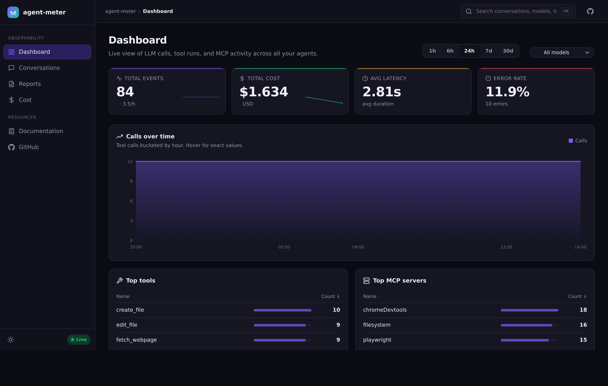
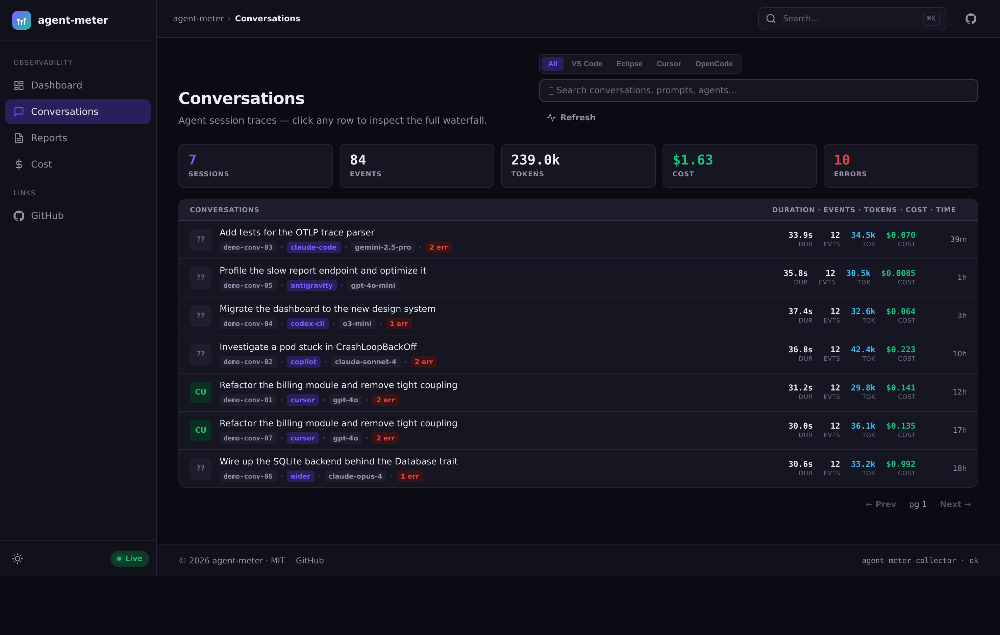
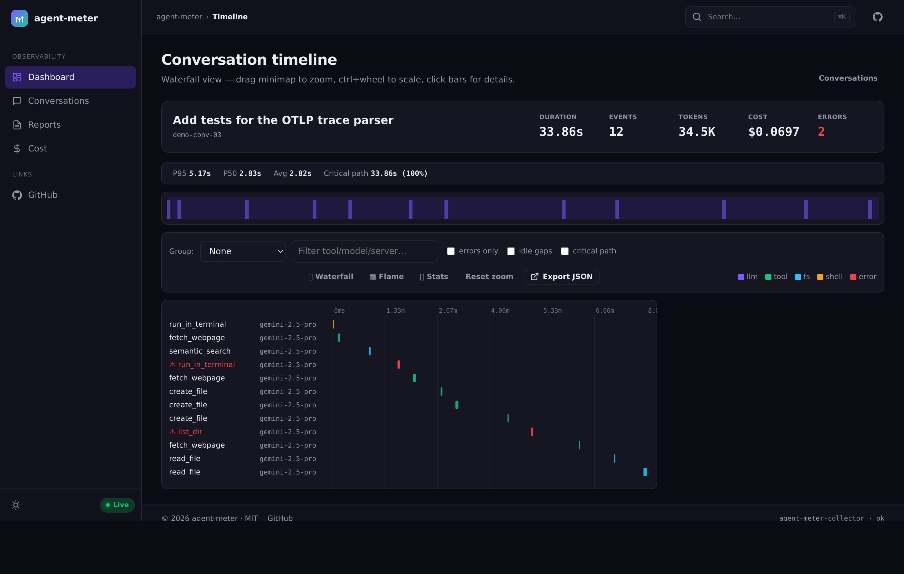
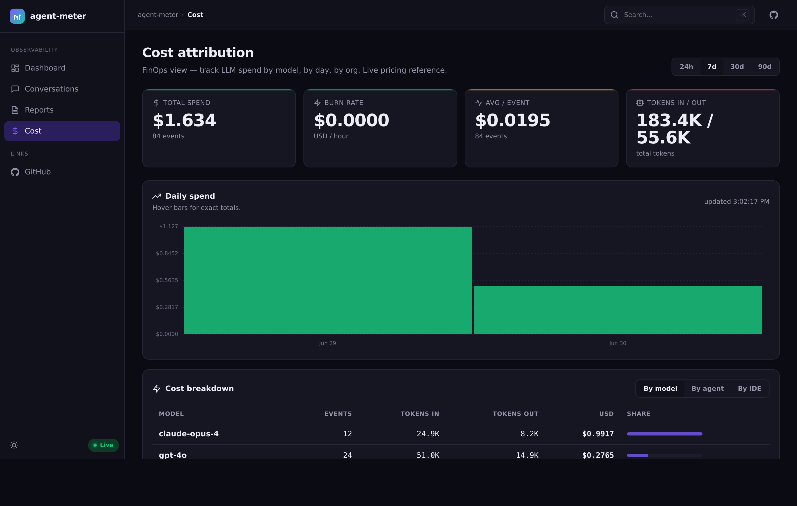

<div align="center">

# 📊 agent-meter

### Observability & FinOps for AI-powered development — in a single self-hosted binary.

Track every **LLM call**, **prompt**, **tool invocation**, **conversation** and **token** spent
across all your IDEs and AI agents. No accounts, no cloud, no database to provision:
**one binary**, a local **SQLite** file, and a dashboard on `localhost`.

[](https://github.com/dnorio/agent-meter/releases)
[](LICENSE)


<br/>



</div>

---

## ✨ Why agent-meter

- **One binary, zero setup.** Embedded Web UI + REST API + OTLP receiver + SQLite. No services to wire up.
- **Local-first & private.** Binds to `127.0.0.1`, stores everything in a local file, never phones home.
- **Multi-agent by design.** Cursor, VS Code / GitHub Copilot, Claude Code, Codex CLI, Eclipse, OpenCode — all in one place.
- **FinOps built in.** Token and USD cost attribution by model, by day, with burn-rate and per-session breakdowns.
- **Trace-level drill-down.** Every conversation has a waterfall timeline of prompts, tool calls, latencies and errors when the source exposes them.

---

## 🚀 Quick start

### Install (one-liner)

```bash
# Linux / macOS
curl -fsSL https://raw.githubusercontent.com/dnorio/agent-meter/main/install.sh | bash

# Windows (PowerShell)
irm https://raw.githubusercontent.com/dnorio/agent-meter/main/install.ps1 | iex
```

Installs a single `agent-meter` binary to `~/.local/bin`. It downloads a
prebuilt release binary when one is available, otherwise builds from source
(needs [Rust](https://rustup.rs) 1.75+ and `git`). Then:

```bash
agent-meter demo    # see it instantly, with realistic synthetic data
agent-meter serve   # run for real and ingest your own events
```

### From source

```bash
git clone https://github.com/dnorio/agent-meter.git
cd agent-meter

# See it instantly, with realistic synthetic data
cargo run -p agent-meter-collector -- demo
# → seeds sample conversations and opens http://127.0.0.1:8081

# Run for real (ingest your own events)
cargo run -p agent-meter-collector -- serve
# → http://127.0.0.1:8081  (UI + REST API)
# → http://127.0.0.1:4318  (OTLP receiver)
```

`demo` generates realistic activity (multiple agents, models, tools, costs and
errors) so every page has something to show. It never collects real data and
won't re-seed a database that already has data — pass `--force` to reseed.

State lives in `agent-meter.db` (SQLite) in the working directory. **Zero
configuration required.**

> 📦 **Prebuilt binaries** will be attached to [Releases](https://github.com/dnorio/agent-meter/releases).
> Until the first release is published, the installer falls back to building from source.

---

## 🖼️ Screenshots

<table>
  <tr>
    <td width="50%"><b>Dashboard</b> — KPIs, calls over time, top tools & MCP servers<br/></td>
    <td width="50%"><b>Conversations</b> — every agent session as a trace<br/></td>
  </tr>
  <tr>
    <td width="50%"><b>Timeline</b> — per-session waterfall of tool calls<br/></td>
    <td width="50%"><b>Cost</b> — token & USD attribution by model and day<br/></td>
  </tr>
</table>

---

## 📡 Sending data

agent-meter accepts telemetry three ways:

| Method | Source | How |
|--------|--------|-----|
| **REST** | Any agent / script | `POST /events/tool-call` (JSON) |
| **OTLP** | VS Code (GitHub Copilot), any OTel exporter | Point the OTLP HTTP exporter at `:4318` |
| **HTTPS proxy** | Cursor, Eclipse, Claude Code, Codex CLI | mitmproxy addons in [`eclipse-proxy/`](eclipse-proxy/) |

### Example — REST ingest

```bash
curl -X POST http://127.0.0.1:8081/events/tool-call \
  -H "Content-Type: application/json" \
  -d '{
    "event_id": "11111111-1111-4111-8111-111111111111",
    "tool_name": "read_file",
    "mcp_server": "filesystem",
    "agent": "cursor",
    "model": "gpt-4o",
    "conversation_id": "demo-1",
    "started_at": "2026-01-15T10:00:00Z",
    "ended_at": "2026-01-15T10:00:01Z",
    "ok": true,
    "estimated_input_tokens": 1200,
    "estimated_output_tokens": 300
  }'
```

### Example — VS Code (GitHub Copilot via OTLP)

```json
{
  "github.copilot.chat.otel.enabled": true,
  "github.copilot.chat.otel.otlpEndpoint": "http://127.0.0.1:4318"
}
```

> 🐧 **Running on WSL?** Follow the step-by-step
> [WSL + Copilot quickstart](docs/QUICKSTART-WSL-COPILOT.md) to capture live
> Copilot activity from another machine.

---

## 📑 Pages

| Page | Route | What it shows |
|------|-------|---------------|
| **Dashboard** | `/` | KPIs, calls over time, top tools & MCP servers |
| **Conversations** | `/conversations` | Agent sessions grouped by `conversation_id`, with drill-down |
| **Timeline** | `/conversations/:id/timeline` | Per-conversation waterfall of tool calls |
| **Reports** | `/reports` | Query-able tiles; every tile is also a JSON endpoint |
| **Cost** | `/cost` | Token usage and USD attribution by model and day |

---

## 🔌 API reference

| Method | Endpoint | Description |
|--------|----------|-------------|
| `POST` | `/events/tool-call` | Ingest a tool-call event |
| `POST` | `/v1/traces` | OTLP trace ingest (port `:4318`) |
| `GET` | `/api/conversations` | List conversations (paginated) |
| `GET` | `/api/conversations/:id/timeline` | Conversation timeline (events + summary) |
| `GET` | `/reports/calls-over-time` | Time-series of tool calls |
| `GET` | `/reports/top-tools` | Most-used tools |
| `GET` | `/reports/top-mcp-servers` | Most active MCP servers |
| `GET` | `/api/cost/summary` | Token & USD cost summary |
| `DELETE` | `/api/conversations/:id` | Delete one session and all its events |
| `POST` | `/api/admin/reset` | Wipe all ingested events (local reset) |
| `GET` | `/health` | Health check |

---

## ⚙️ Configuration

All settings have sensible defaults; override via environment variables or a TOML
file (`--config agent-meter.toml`, see [`agent-meter.example.toml`](agent-meter.example.toml)).

| Variable | Default | Description |
|----------|---------|-------------|
| `AGENT_METER_HOST` | `127.0.0.1` | Bind address |
| `AGENT_METER_PORT` | `8081` | UI + REST port |
| `AGENT_METER_OTLP_PORT` | `4318` | OTLP receiver port |
| `DATABASE_URL` | `sqlite://agent-meter.db` | SQLite by default; `postgres://…` also supported |
| `AGENT_METER_NO_OPEN` | _(unset)_ | Set to skip auto-opening the browser |
| `RUST_LOG` | `info` | Log level |

> **PostgreSQL is optional.** Point `DATABASE_URL` at a `postgres://` URL for a
> shared/server deployment; SQLite is the zero-config default.

> **Cost estimates.** When a client doesn't send an explicit cost, agent-meter
> estimates USD from token counts using approximate public per-model list prices,
> so the FinOps views always have a sensible number.

### Managing local data

```bash
# Delete one conversation (and all its events)
curl -X DELETE http://127.0.0.1:8081/api/conversations/demo-conv-03

# Wipe everything (fresh start before a live capture)
curl -X POST http://127.0.0.1:8081/api/admin/reset
```

Both endpoints are localhost-only by default (`127.0.0.1` bind). No auth token
required — intended for local dev and demos.

---

## 🗂️ Project structure

```
agent-meter/
├── crates/
│   ├── collector/           # Axum HTTP server (REST API + OTLP + embedded Web UI)
│   │   ├── src/
│   │   │   ├── routes/      # API + page handlers
│   │   │   ├── otlp/        # OTLP receiver + IDE detection
│   │   │   ├── services/    # Event mapping, ingest buffer
│   │   │   └── demo.rs      # Synthetic data generator (`demo` command)
│   │   └── ui/              # HTML pages + static assets (embedded in the binary)
│   ├── db/                  # Database trait + SQLite & Postgres implementations
│   ├── cli/                 # CLI client
│   ├── proxy/               # HTTPS proxy helpers
│   └── mcp-wrapper/         # MCP wrapper proxy
├── eclipse-proxy/           # mitmproxy addon (Eclipse + Copilot CLI)
├── sdk/                     # Client SDKs (Node, Python)
├── migrations/              # Postgres migrations (optional backend)
├── docs/                    # Documentation
└── docker-compose.standalone.yml
```

---

## 🔒 Privacy

- **Local-first.** Binds to `127.0.0.1` and stores everything in a local SQLite file. No external telemetry, no phone-home.
- **No credentials stored.** The collector records tool-call metadata, not your API keys.

## 🛡️ Security

- **Pre-public gates:** `oss-scrub-check.sh` (tree) + `secret-scan-history.sh` (gitleaks + all blobs) + `history-audit.sh` (history).
- **Private pattern checks:** maintainers can provide local-only patterns via ignored `scripts/ci/private-patterns.txt`.
- **Report issues:** [SECURITY.md](SECURITY.md)

---

## 📄 License

[MIT](LICENSE) © agent-meter contributors
